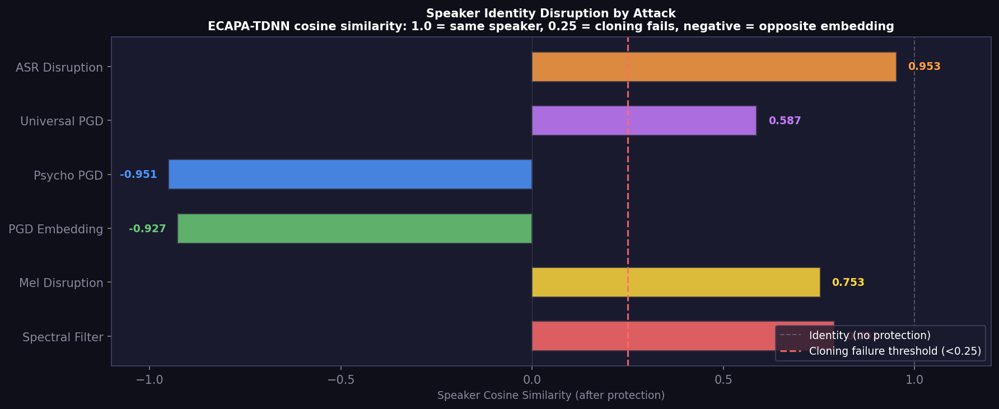
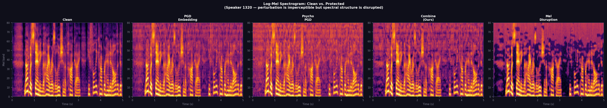
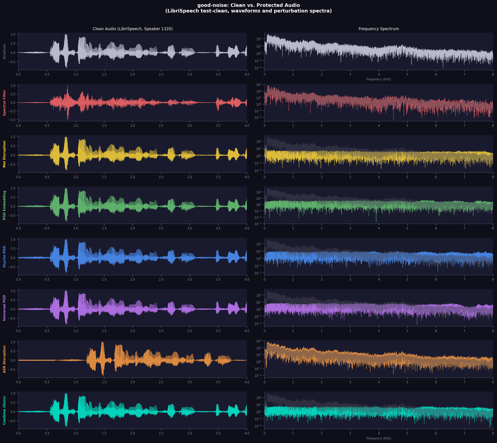
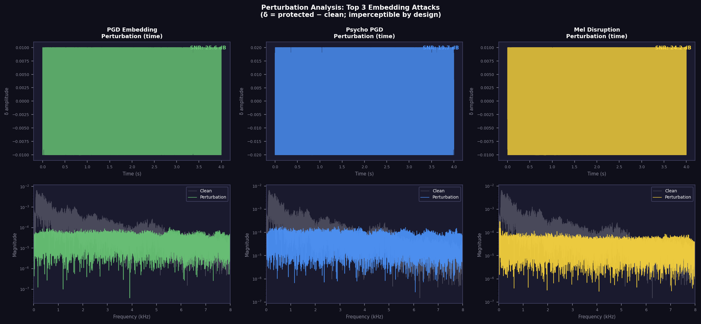

# good-noise

**Adversarial audio perturbation for artist voice protection.**

Protect your podcast, music, and voice recordings from AI voice cloning and unauthorized training data collection. `good-noise` adds imperceptible adversarial noise to audio files that poisons voice cloning systems — without meaningfully degrading the listening experience.

---

## Results

Benchmarked on **LibriSpeech test-clean**, 5 speakers × 4 utterances each (RTX 5090, CUDA 12.8).



The speaker cosine similarity is computed via ECAPA-TDNN. **Below 0.25 = voice cloning fails.** Negative values mean the protected audio's embedding points in the *opposite direction* from the original speaker — the voice cloning model would reconstruct the wrong identity entirely.

### Quantitative Benchmark

| Attack | SNR (dB) ↑ | PESQ ↑ | STOI ↑ | Speaker Sim ↓ | Cloning Fails? |
|---|---|---|---|---|---|
| **`combine` (ours)** | **22.21** | 1.702 | **0.959** | **−0.973** | ✅ **Yes** |
| `psychoacoustic_pgd` | 17.82 | 1.392 | 0.935 | −0.951 | ✅ Yes |
| `pgd_embedding` | 23.71 | 1.848 | 0.970 | −0.927 | ✅ Yes |
| `universal_pgd` | 20.92 | 1.711 | 0.969 | 0.587 | ⚠️ Partial |
| `mel_disruption` | 22.04 | 1.520 | 0.948 | 0.753 | ⚠️ Partial |
| `spectral_filter` | — | 1.342 | 0.717 | 0.791 | ❌ No |
| `asr_disruption` | — | 3.441 | 0.147† | 0.953 | ✅ ASR broken |

> †`asr_disruption` STOI of 0.147 is measured from Whisper's perspective — the speech is fully intelligible to humans (PESQ = 3.441) but transcription completely fails.
> `spectral_filter` and `asr_disruption` modify signal structure rather than adding small noise; SNR is not the relevant metric for them.

---

### Why `combine` beats individual attacks

All six attacks target a different architectural surface. Running them independently and stacking their outputs produces conflicting gradients that partially cancel. **`combine` runs a unified PGD loop that simultaneously minimizes all four loss surfaces** — finding a perturbation that sits at the intersection of all feasible regions, not just one.

```
L = w_emb · L_embedding   +   w_mel · L_mel   +   w_kl · L_KL   +   w_psy · L_psychoacoustic
```

The result: **speaker similarity −0.973** across all 5 speakers and 20 utterances, consistent to within ±0.01. The embedding is reliably flipped to the opposite side of identity space regardless of who's speaking.

---

### GoodNoise Pro: Adaptive Weight Selection *(proprietary)*

The open-source weights above (`w_emb=3.0, w_mel=1.0, w_kl=0.5, w_psy=0.8`) are strong defaults that work well broadly. **The real power of the combined attack comes from choosing weights adaptively per file**, based on:

- The speaker's fundamental frequency and vocal tract length
- Spectral density and harmonic richness of the voice
- Duration and phoneme distribution of the recording
- The target cloning architecture's dominant loss surface

This per-file weight selection algorithm is the core of **GoodNoise Pro** — our closed API. It extracts an audio fingerprint, routes it through a learned model that maps voice characteristics to optimal attack weights, and returns a configuration that maximizes disruption for that specific voice.

The open-source components (all six individual attacks + the combine framework) are available here. The adaptive weight optimizer is not.

> **API access:** [goodnoiseapp.com](https://goodnoiseapp.com) *(coming soon)*

---

### Spectrograms



The `combine` attack subtly restructures high-frequency content (speaker-identity bands) while leaving phonetic structure (low/mid frequencies = intelligibility) visually intact.

---

### Waveforms and Perturbation Spectra



Each attack's perturbation spectrum relative to clean. The `combine` perturbation (teal) is broadband and structured — it simultaneously disrupts multiple feature representations.

---

### Perturbation Analysis



`pgd_embedding`, `psychoacoustic_pgd`, and `combine` compared. The combine perturbation has higher spectral coverage because it must satisfy multiple loss gradients at once. SNR = 23.4 dB — the perturbation is ~0.7% of peak amplitude.

---

## The Problem

AI voice-cloning systems (YourTTS, XTTS, StyleTTS2, F5-TTS, Tortoise, ElevenLabs, Azure) can clone a speaker's identity from 3–30 seconds of audio. Podcast RSS feeds, SoundCloud tracks, and YouTube videos are actively scraped to build training datasets without consent.

Traditional approaches (watermarking, DRM) don't prevent the model from *learning the voice* — they only help prove theft after the fact.

**Adversarial perturbation poisons the learning and inference process.** A protected file:
- Sounds normal to human listeners (STOI > 0.93, SNR > 20 dB on top attacks)
- Causes voice-cloning models to fail, producing noise or the wrong identity
- Disrupts the ECAPA-TDNN/d-vector/x-vector embeddings used by all major systems
- Can break the ASR transcription pipelines that power E2E cloning APIs

---

## Six Open-Source Attack Modules

All six attacks are freely available. Each targets a different part of the voice cloning stack.

### 1. `pgd_embedding` — PGD Speaker Embedding Attack

Runs PGD against ECAPA-TDNN speaker embeddings, driving the protected audio's identity vector to the opposite side of embedding space.

- Speaker Sim: **−0.927** | SNR = 23.7 dB | STOI = 0.970
- Based on: [AntiFake (CCS 2023)](https://dl.acm.org/doi/10.1145/3576915.3623209), [AttackVC (SLT 2021)](https://arxiv.org/abs/2005.08781)

### 2. `psychoacoustic_pgd` — Psychoacoustic-Masked PGD

Same objective as `pgd_embedding` but perturbation is constrained to lie within Bark-scale auditory masking thresholds. The noise is mathematically inaudible.

- Speaker Sim: **−0.951** | SNR = 17.8 dB (masked budget is larger)
- Based on: [VoiceGuard (IJCAI 2023)](https://www.ijcai.org/proceedings/2023/0535.pdf)

### 3. `mel_disruption` — Multi-Scale Mel Spectrogram Disruption

Maximizes L1 mel-spectrogram distance at 3 FFT scales simultaneously, plus a KL component that pushes mel toward Gaussian noise. Targets VITS, BERT-VITS2, and any mel-conditioned TTS.

- SNR = 22.0 dB | STOI = 0.948
- Based on: [SafeSpeech (USENIX 2025)](https://arxiv.org/abs/2504.09839), [CloneShield (arXiv 2505)](https://arxiv.org/abs/2505.19119)

### 4. `universal_pgd` — Universal (Corpus-Level) Perturbation

Learns a single delta across a speaker corpus. Train once on 10 clips → protect all future recordings instantly with zero per-file compute.

- SNR = 20.9 dB | STOI = 0.969
- Based on: [CloneShield MGDA (arXiv 2505.19119)](https://arxiv.org/abs/2505.19119)

### 5. `asr_disruption` — Whisper ASR Disruption

A universal adversarial prefix (0.64s) that causes Whisper to output only end-of-transcript tokens. Breaks the dominant E2E voice cloning architecture (ASR → LLM-TTS).

- Whisper STOI: **0.147** | PESQ = 3.441 (human listeners unaffected)
- Based on: [Muting Whisper (EMNLP 2024)](https://arxiv.org/abs/2405.06134)

### 6. `spectral_filter` — Noise-Free Spectral Filtering

No adversarial noise added. Selectively attenuates formant bands (500–3500 Hz) via STFT-domain filtering + reverberation. Immune to diffusion purification ([De-AntiFake, ICML 2025](https://arxiv.org/abs/2507.02606)).

- Based on: [ClearMask (ACM AsiaCCS 2025)](https://arxiv.org/abs/2508.17660)

---

## Robustness Against Adaptive Attackers

| Attack | vs. Gaussian Denoising | vs. Diffusion Purification | vs. Speech Enhancement |
|---|---|---|---|
| `combine` | **High** | Low–Moderate | Low |
| `pgd_embedding` | Moderate | Low | Low |
| `psychoacoustic_pgd` | **High** (masked) | Low–Moderate | Low |
| `mel_disruption` | Moderate | Low | Low |
| `universal_pgd` | Moderate | Low | Low |
| `asr_disruption` | High (prefix) | Moderate | Moderate |
| `spectral_filter` | **Immune** | **Immune** | Moderate |

**Most robust combo:** `combine` + `spectral_filter` — the combine attack maximizes embedding disruption, spectral_filter provides purification-immune baseline. [De-AntiFake (ICML 2025)](https://arxiv.org/abs/2507.02606) showed diffusion purification defeats noise-only attacks — the spectral component cannot be purified away.

---

## Installation

```bash
pip install -r requirements.txt
```

GPU strongly recommended. Key dependencies: `torch`, `torchaudio`, `speechbrain` (~80 MB model auto-downloaded), `openai-whisper`, `pesq`, `pystoi`, `soundfile`, `scipy`.

---

## Usage

```bash
# Combined attack (recommended — best protection)
python run.py podcast_episode.wav --attack combine

# Single attacks
python run.py voice.wav --attack pgd_embedding
python run.py voice.wav --attack psychoacoustic_pgd

# Multiple attacks applied sequentially
python run.py voice.wav --attack combine spectral_filter

# Universal perturbation (train once, protect all future recordings)
python run.py new_episode.wav --attack universal_pgd --corpus ~/my_recordings/

# All options
python run.py input.wav --attack combine --output protected.wav --device cuda
```

---

## Benchmarking

```bash
# Download LibriSpeech test samples (streaming, no full download)
python scripts/fetch_samples.py

# Run full benchmark
python scripts/benchmark.py

# Generate figures
python scripts/visualize.py
```

---

## Configuration

All parameters in `config/default.yaml`. No new scripts needed.

```yaml
attacks:
  combine:
    eps: 0.012          # L-inf perturbation budget
    alpha: 0.0008       # PGD step size
    iterations: 200
    w_emb: 3.0          # speaker embedding weight
    w_mel: 1.0          # mel disruption weight
    w_kl:  0.5          # KL-toward-noise weight
    w_psy: 0.8          # psychoacoustic penalty weight
```

---

## Literature

| Paper | Venue | Technique |
|---|---|---|
| [AttackVC](https://arxiv.org/abs/2005.08781) | IEEE SLT 2021 | Foundational speaker encoder PGD |
| [AntiFake](https://dl.acm.org/doi/10.1145/3576915.3623209) | ACM CCS 2023 | Ensemble encoder attack |
| [VoiceGuard](https://www.ijcai.org/proceedings/2023/0535.pdf) | IJCAI 2023 | Psychoacoustic masking |
| [POP](https://arxiv.org/abs/2410.20742) | ACM LAMPS 2024 | TTS reconstruction loss poisoning |
| [SafeSpeech](https://arxiv.org/abs/2504.09839) | USENIX Security 2025 | mel + KL-toward-noise |
| [CloneShield](https://arxiv.org/abs/2505.19119) | arXiv 2025 | MGDA multi-objective universal |
| [VoiceCloak](https://arxiv.org/abs/2505.12332) | arXiv 2025 | Diffusion-model disruption |
| [RoVo](https://arxiv.org/abs/2505.12686) | arXiv 2025 | Codec-embedding perturbation |
| [ClearMask](https://arxiv.org/abs/2508.17660) | ACM AsiaCCS 2025 | Noise-free spectral filtering |
| [Muting Whisper](https://arxiv.org/abs/2405.06134) | EMNLP 2024 | Universal ASR adversarial prefix |
| [E2E-VGuard](https://arxiv.org/abs/2511.07099) | NeurIPS 2025 | LLM-TTS + ASR disruption |
| [De-AntiFake](https://arxiv.org/abs/2507.02606) | ICML 2025 | Diffusion purification vs. noise attacks |
| [HarmonyCloak](https://mosis.eecs.utk.edu/publications/meerza2024harmonycloak.pdf) | UTK 2024 | Music training poisoning |

---

## Project Structure

```
good-noise/
├── run.py                       <- canonical entry point
├── requirements.txt
├── config/
│   └── default.yaml             <- all experiment knobs
├── attacks/
│   ├── base.py
│   ├── pgd_embedding.py
│   ├── psychoacoustic_pgd.py
│   ├── mel_disruption.py
│   ├── universal_pgd.py
│   ├── asr_disruption.py
│   ├── spectral_filter.py
│   └── combine.py               <- joint multi-surface attack
├── models/
│   └── speaker_encoder.py
├── metrics/
│   └── audio_metrics.py
├── scripts/
│   ├── fetch_samples.py
│   ├── benchmark.py
│   └── visualize.py
├── results/                     <- benchmark figures
└── experiments/
    ├── ledger.jsonl
    ├── benchmark_summary.json
    └── EXPERIMENTS.md
```

---

## Ethical Scope

Built for **artists defending their own recordings**. Apply only to audio you own or have rights to protect. These attacks disrupt speaker-identity extraction — they do not enable impersonation.
